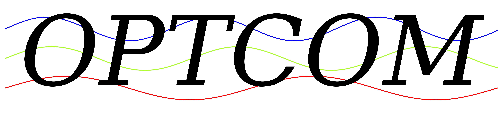
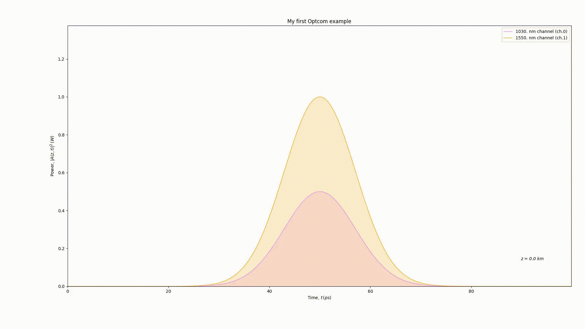

<div align="center">
  
</div>

# Optcom: Open Source Optical System Simulator

[](https://www.python.org/)
[](https://badge.fury.io/py/optcom)
[](https://gitter.im/optcom-org/optcom?utm_source=badge&utm_medium=badge&utm_campaign=pr-badge)
[](https://optcom.readthedocs.io/en/latest/?badge=latest)

## What is Optcom ?

Optcom is a Python library which aims to simulate optical systems.
Optcom has been build for both advanced research and teaching purposes.

<<<<<<< HEAD
On one hand, Optcom can be used as an optical system simulation
=======
One one hand, Optcom can be used as an optical system simulation
>>>>>>> 88e09f0dfee0692730bbab7800a2d2dcc13e131a
framework in which users can create their own optical / electric
components and benefit from a wide range of helper functions. On the
other hand, Optcom can be used with the in-build components for
state-of-the art optical system simulation.

Moreover, user-friendly experience is at the heart of Optcom approach.
In Optcom, an optical system is built by linking the ports of different
<<<<<<< HEAD
components to each other. Here is a small example of what can be done:
=======
components to each other. Here is a small example of what can be done.
>>>>>>> 88e09f0dfee0692730bbab7800a2d2dcc13e131a

```python
from optcom import *

# Create 2 Gaussian channels
pulse = Gaussian(channels=2, center_lambda=[1030., 1550.], peak_power=[0.5, 1.0])
# Create fiber with a user-defined attenuation coefficient
fiber = Fiber(length=1.0, alpha=[0.4], ATT=True, DISP=True, SPM=True, save_all=True)
# Create an optical layout and link the 2 first ports of pulse and fiber
layout = Layout()
layout.link((pulse[0], fiber[0]))
layout.run_all()
# Extract outputs and plot
time = fiber.storage.time
power = temporal_power(fiber.storage.channels)
space = fiber.storage.space
animation2d(time, power, space, x_label=['t'], y_label=['P_t'],
            plot_title='My first Optcom example',
            plot_labels=['1030. nm channel', '1550. nm channel'])

```




## Tutorials

See [`tutorials/`](tutorials) for basic and advanced tutorials.

## Requirements
Installation should be OS independent. Python3.7 or later version is
required. See https://www.python.org/downloads/ for more detail about
python installation.

As an example, in Ubuntu, Debian or Mint, python 3 can be installed
with:

```sh
sudo apt-get install python3 python3-pip
```

## Install
<<<<<<< HEAD
Optcom can be installed using pip with:
=======
Optcom can be install using pip with:
>>>>>>> 88e09f0dfee0692730bbab7800a2d2dcc13e131a

```sh
python3 -m pip install optcom
```
<<<<<<< HEAD
Or in order to run the latest version of the code from the git repo:
=======
Or in order to run the later version of the code from the git repo:
>>>>>>> 88e09f0dfee0692730bbab7800a2d2dcc13e131a

```sh
python3 -m pip install git+git://github.com/optcom-org/optcom/
```

<<<<<<< HEAD
The required dependencies should have been installed along the pip
installation, if any trouble is encountered, the dependencies can be
manually install by chance of the requirements.txt file with:
=======
The require dependencies should be installed along the pip installation,
if any trouble is encountered, the dependencies can be manually install
by chance of the requirements.txt file with:
>>>>>>> 88e09f0dfee0692730bbab7800a2d2dcc13e131a

```sh
python3 -m pip install -r requirements.txt
```

## Issues and Questions

For bug report or suggestion, please use the Optcom issue tracker:
https://github.com/optcom-org/optcom/issues

<<<<<<< HEAD
To ask questions about the usage of Optcom, use the Gitter repo:
=======
To ask questions about the usage of Optcom, use the gitter repo:
>>>>>>> 88e09f0dfee0692730bbab7800a2d2dcc13e131a
https://gitter.im/optcom-org/optcom

For any matter that does not concern the aforementioned ones, send an
email to info@optcom.org


## Contributing

Any contribution is welcome !

Optcom provides an optical system simulation framework and is as rich
as the number of components that can be used. You enjoy Optcom and
<<<<<<< HEAD
created your own component to fulfill your simulation need ? Share it
=======
createed your own component to fulfill your simulation need ? Share it
>>>>>>> 88e09f0dfee0692730bbab7800a2d2dcc13e131a
with the community!  See [`tutorials/`](tutorials) to learn
how to create your own component.

Any help in testing, development or documentation is highly appreciated
and can be done from contributors of all experience levels. Please have
a look at the [`ROADMAP.md`](ROADMAP.md) to see which tasks are available.

For contribution instructions and guidelines, please see
[`CONTRIBUTING.md`](CONTRIBUTING.md).

## Documentation

Find the built documentation at https://readthedocs.org/projects/optcom/

To manually build the documentation, go in [`docs/`](docs/) and type:
```sh
<<<<<<< HEAD
make clean && make html
=======
make html
>>>>>>> 88e09f0dfee0692730bbab7800a2d2dcc13e131a
```

## Release History

* 0.1.0
    * The first draft of Optcom.
* 0.2.0
    * The first Beta version of Optcom.

## Hosting

<<<<<<< HEAD
The source code is hosted at https://github.com/optcom-org/optcom
=======
The source code is host at https://github.com/optcom-org/optcom
>>>>>>> 88e09f0dfee0692730bbab7800a2d2dcc13e131a

## Citation

If you use Optcom, please cite it as:

```
@misc{Optcom-org-optcom,
  title = {{Optcom}: A Python library for optical system simulation},
  author = "{Sacha Medaer}",
  howpublished = {\url{https://github.com/optcom-org/optcom}},
  url = "https://github.com/optcom-org/optcom",
  year = 2019
}
```

## License

Optcom is licensed under the terms of the GNU V3 License, see
[`LICENSE.md`](LICENSE.md).

## Disclaimer

<<<<<<< HEAD
Optcom is a free open source Software developed and maintained by
=======
Optcom is an free open source Software developed and maintained by
>>>>>>> 88e09f0dfee0692730bbab7800a2d2dcc13e131a
volunteers. The authors take no responsibility, see
[`LICENSE.md`](LICENSE.md).

<!-- Markdown link & img dfn's -->
